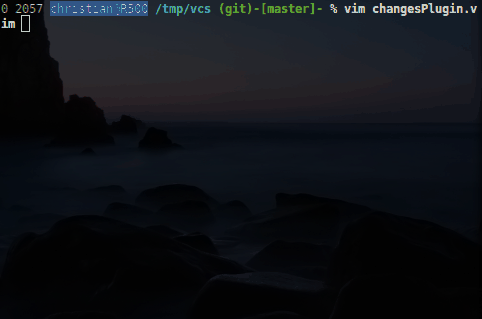

# Changes plugin [](https://saythanks.io/to/cb%40256bit.org)
> A Vim plugin for displaying changes in a buffer

This plugin was written to help visualize which lines have been changed since
editing started for a file. The plugin was inspired by so called changed-bars,
available in other editors, such as Embarcadero C++ Builder (there it is
called [Change Bars](http://edn.embarcadero.com/article/33453#6PersonalDeveloperProductivity)
or Visual Studio where it is called [indicator margin](http://blog.eveningcreek.com/?p=151).

ChangesPlugin.vim uses the diff feature of vim and compares the actual
buffer with its saved state (or possibly against a state in a VCS repository).
It displays signs in the signcolumn to indicate any changes, with optional line highlighting.

See also the following screencast showing several of the features available:


Note, that a '-' indicates that at least one line was deleted between that
particular line and the following line.

Features:
* Shows signs for added, modified, and deleted lines
* Quick jumping between changed blocks ("hunks")
* Tries to update signs as fast as possible
* Optional line highlighting
* Customisable
* Many different Commands (fold all non changed lines, show changed lines in Quickfix window, opens a diff split...)
* Preserves signs from other plugins
* Built-in integration with [vim-airline](https://github.com/vim-airline/vim-airline/)
* Good documentation
* Quick response
* Nice icons for gvim
* Uses Vim 8's async feature for parsing the diff

#### Why another git-gutter/vim-signify clone?
To be fair, there were a lot of other vim plugins that offered the same functionality as those two. They just didn't get the same attention as those two. ChangesPlugin was one of those plugins.

### Installation
Vim 8 comes with package support. Simply clone it into your packpath like this:
```
cd ~/.vim/pack/custom/start/
git clone https://github.com/chrisbra/changesPlugin.git
```
(Remember to run `:helptags ALL` after restarting Vim to regenerate the help files)

Other installation methods:

| Plugin Manager | Install with... |
| ------------- | ------------- |
| [Pathogen][1] | `git clone https://github.com/chrisbra/changesPlugin ~/.vim/bundle/changesPlugin`<br/>Remember to run `:Helptags` to generate help tags |
| [NeoBundle][2] | `NeoBundle 'chrisbra/changesPlugin'` |
| [Vundle][3] | `Plugin 'chrisbra/changesPlugin'` |
| [Plug][4] | `Plug 'chrisbra/changesPlugin'` |
| [VAM][5] | `call vam#ActivateAddons([ 'changesPlugin' ])` |
| [Dein][6] | `call dein#add('chrisbra/changesPlugin')` |
| [minpac][7] | `call minpac#add('chrisbra/changesPlugin')` |
| manual | copy all of the directories into your `~/.vim` directory (preserve existing directories)|

Other package managers work similarly, please refer to their documentation.

### Usage
Once installed, take a look at the help at `:h ChangesPlugin`

Here is a short overview of the functionality provided by the plugin:
#### Ex commands:
    :EC  - Activate the plugin (display indicators of changes for the current buffer)
    :DC  - Disable the plugin
    :TCV - Toggle the plugin
    :CC  - Show a small help window
    :CL  - Open the Quickfix window with all changes for the current buffer
    :CD  - Open a diff view for the current buffer
    :CF  - Fold away all non-changed lines
    :CT  - Toggle how the highlighting is displayed
#### Mappings
    ]h   - Moves forward to the next changed line
    [h   - Moves backwards to the previous changed line
    ah   - Selects the current hunk (TextObject)
    <Leader>h - Stage the hunk that the cursor is on (works only for git)

### Configuration

`g:changes_autocmd` (default: 1) - update the signs automatically using InsertLeave and TextChanged autocommands.

`g:changes_vcs_check` (default: 0)

`g:changes_vcs_system` (default: '') - Check against a version in a repository (e.g. git/mercurial) and specify VCS to use (if not specified, will try to autodetect).

`g:changes_diff_preview` (default: 0) - Display diff in the preview window

`g:changes_respect_SignColumn` (default 0) - If set, will use the SignColumn Highlighting group, else uses the Normal Highlighting group

`g:changes_sign_text_utf8` (default 1) - If set, will display nice little utf-8 signs.

`g:changes_linehi_diff` (default: 0) - If set, will overlay the text with highlighting for the difference in the line.

`g:changes_use_icons` (default: 1) - If set, will display graphical icons if support is available.

#### Similar Work
[vim-gitgutter](https://github.com/airblade/vim-gitgutter)
Only works for git.

[vim-signify](https://github.com/mhinz/vim-signify/)
Supports several VCS, only updates the sign on write.

### License & Copyright

© 2009-2014 by Christian Brabandt. The Vim License applies. See `:h license`

__NO WARRANTY, EXPRESS OR IMPLIED.  USE AT-YOUR-OWN-RISK__

[1]: https://github.com/tpope/vim-pathogen
[2]: https://github.com/Shougo/neobundle.vim
[3]: https://github.com/VundleVim/Vundle.vim
[4]: https://github.com/junegunn/vim-plug
[5]: https://github.com/MarcWeber/vim-addon-manager
[6]: https://github.com/Shougo/dein.vim
[7]: https://github.com/k-takata/minpac/
